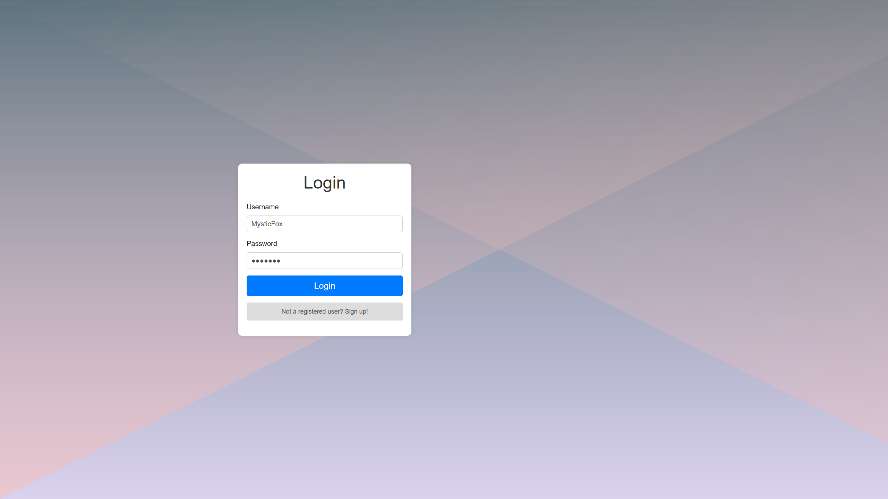
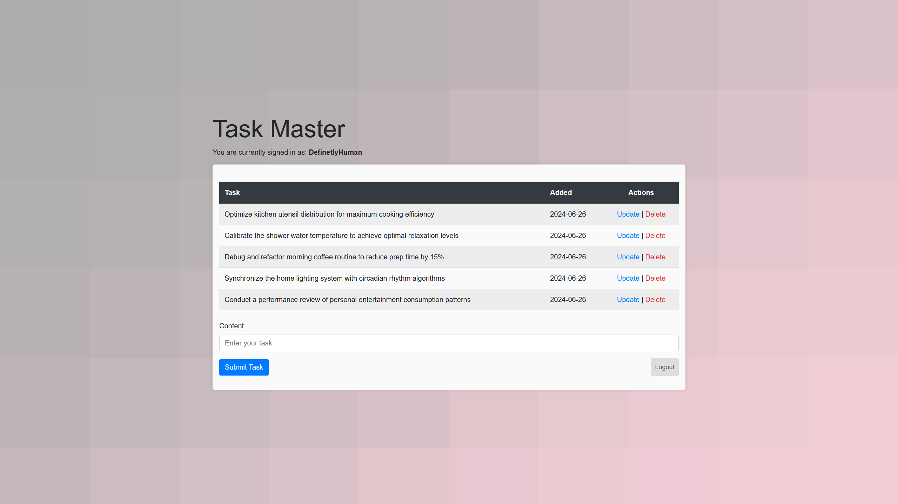

# Python Flask Todo Application

This is a simple Todo application built with Flask, allowing users to register, login, and manage their tasks.

## Prerequisites

Ensure you have the following installed:

- Python 3.6 or later
- pip (Python package installer)

## Installation

1. **Clone the repository:**
    ```bash
    git clone https://github.com/m1zukash1/flask-todo.git
    cd flask-todo
    ```

2. **Create a virtual environment (optional but recommended):**
    ```bash
    python -m venv venv
    .\venv\Scripts\activate   # On MacOS use `source venv/bin/activate`
    ```

3. **Install the dependencies:**
    ```bash
    pip install Flask flask_login flask_bcrypt flask_sqlalchemy flask_wtf wtforms Flask-Migrate
    ```

4. **Run the application:**
    ```bash
    python app.py
    ```
**Note:** You do not need to set up the database separately as it is included in the project. Additionally, the database comes pre-populated with three user accounts:

| Username          | Password         |
|-------------------|------------------|
| BluePanda47       | eatingbird321    |
| MysticFoxy        | snowing          |
| DefinetlyHuman    | realpass888      |

## Features

- **User Authentication:**
  - **Registration and Login:** Users can register and log in to manage their tasks securely.
  - **Secure Password Handling:** Passwords are hashed using `flask_bcrypt` for enhanced security. The database holds only the hashed passwords, and they are sent to the database in their hashed form.

- **Task Management:**
  - **Create, Read, Update, Delete (CRUD):** Users can add, view, edit, and delete their tasks effortlessly.

- **User-Specific Data:**
  - **Personalized Task Lists:** Each user has access to their own task list, ensuring privacy and personalized task management.
  
- **Flash Messages:**
  - **User Feedback:** Informative [flash messages](https://flask.palletsprojects.com/en/2.3.x/patterns/flashing/) provide users with feedback on their actions, enhancing user experience.

- **Responsive UI:**
  - **Bootstrap Integration:** A responsive and user-friendly interface designed with Bootstrap ensures accessibility across devices.

- **Database Integration:**
  - **SQLite Database:** Utilizes SQLite for lightweight and efficient data storage, eliminating the need for complex setup.

## Screenshots

### Registration Page


### Task Management Interface

